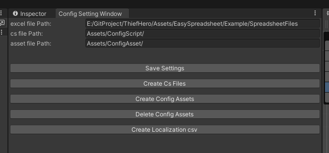

# 配置表工具使用说明

## 简介

本工具是一个基于 Unity 的配置表管理工具，支持从 Excel 文件生成配置数据，并以多种格式（如 ScriptableObject、JSON、二进制）保存和加载。工具还支持本地化功能，可以将配置中的本地化字符串导出为 CSV 文件。

## 功能

1. **配置表生成**
    - 从 Excel 文件生成配置数据。
    - 支持多种数据类型（如 `int`、`float`、`string`、`bool` 等）。
    - 支持数组类型（如 `int[]`、`float[]` 等）。
    - 支持本地化字符串和资源引用。
    - 支持扩展自定义类型。

2. **多种存储格式**
    - 支持 ScriptableObject、JSON 和二进制格式保存配置数据。
    - ScriptableObject无法支持部分复杂结构（例如List<Array>），所以建议使用JSON 和二进制格式。
    - 对JSON 和二进制格式，会对生成的配置数据资产进行加密，在加载时解密。

3. **本地化支持**
    - 自动提取配置中的本地化字符串和资源。
    - 导出本地化数据为 CSV 文件。

4. **异步加载**
    - 支持异步加载配置数据，适用于大规模配置表。

5. **自动代码生成**
    - 自动生成配置表对应的 C# 类和管理类。

## 文件结构

- `ConfigSettingWindow.cs`  
  提供配置工具的设置窗口，允许用户设置 Excel 文件路径、生成的脚本路径和资源路径。

- `ConfigWriter.cs`  
  负责从 Excel 文件生成配置表对应的 C# 类和数据文件。

- `ExcelReader.cs`  
  用于读取 Excel 文件并解析字段信息。

- `ConfBase.cs`  
  定义配置表的基础类和集合类。

- `ConfAsyncLoadHandle.cs`  
  提供异步加载配置数据的功能。

- `AssetRef` 文件夹  
  定义资源引用类型（如 `AudioRef`、`SpriteRef`、`LocalizationStringRef` 等）。

## 使用方法

### 1. 设置路径

打开 Unity 菜单 `Tools > Config > Config Setting Window`，设置以下路径：


- **Excel 文件路径**：存放 Excel 配置表的文件夹路径。
- **脚本文件路径**：生成的 C# 脚本存放路径，此为Assets目录下的相对路径。
- **资源文件路径**：生成的配置资源存放路径，此为Assets目录下的相对路径。

### 2. 生成配置表

在 `Config Setting Window` 中点击以下按钮：



- **Create Cs Files**：根据 Excel 文件生成对应的 C# 类。
- **Create Config Assets**：生成配置表数据文件。
- **Delete Config Assets**：删除已生成的配置表数据文件。

### 3. 本地化支持

- **Create Localization csv**：提取配置表中的本地化字符串和资源，生成 CSV 文件。

### 4. 加载配置

使用 `ConfigGroup` 类加载指定的配置表，并在不需要时清除配置表缓存：

```csharp
// 事件注册形式加载 guidanceConf 和 guidanceConf
public void LoadConfig()
{
    ConfigGroup<CommonConfigLoader> configGroup = new ConfigGroup<CommonConfigLoader>(ConfigManager.instance.guidanceConf);
    configGroup.Append(ConfigManager.instance.rolePropConf);
    configGroup.onLoadCompleted += OnInitConfLoadCompleted;
    configGroup.LoadAll();
}

void OnInitConfLoadCompleted(AssetLoadStatus status)
{
    if (status == AssetLoadStatus.Loaded)
    {
        Debug.Log("配置加载成功");
    }
    else
    {
        Debug.LogError("配置加载失败");
    }
}

// 使用协程加载
public void LoadConfigCoroutine()
{
    CoroutineRunner.StartCoroutine(LoadConfigCoroutineHandle());
}

void LoadConfigCoroutineHandle(AssetLoadStatus status)
{
    ConfigGroup<CommonConfigLoader> configGroup = new ConfigGroup<CommonConfigLoader>(ConfigManager.instance.guidanceConf);
    configGroup.Append(ConfigManager.instance.rolePropConf);
    configGroup.onLoadCompleted += OnInitConfLoadCompleted;
    yield return configGroup.LoadAll();

    if (configGroup.loadStatus == AssetLoadStatus.Loaded)
    {
        Debug.Log("配置加载成功");
    }
    else
    {
        Debug.LogError("配置加载失败");
        string[] failed = configGroup.failLoadConfigs;
        for (var i = 0; i < failed.Length; i++)
        {
            Debug.LogError(failed[i] + "加载失败")
        }
    }

    // 清除配置表缓存，之后需要再重新加载
    configGroup.ReleaseAll();
}
```

### 5. 获取配置数据

通过 `ConfigManager` 获取具体配置表数据：

```csharp
// 通过key获取特定配置数据
RolePropConf roleConfig = ConfigManager.instance.rolePropConf.Get(roleId);
Debug.Log($"角色名称: {roleConfig.name}");

// 获取全部配置数据
List<RolePropConf> roleConfigList = ConfigManager.instance.rolePropConf.rawData;
// Do something with List<RolePropConf>...
foreach (var conf in roleConfigList)
{
    Debug.Log($"角色名称: {conf.name}");
}

List<RolePropConf> matched = roleConfigList.Where(o => o.atk > 10 && o.atk < 20).ToList();
...
```

### 6. 扩展自定义类型

下面以 `TimeDateRef` 为例，假设 `TimeDateRef` 类型是将配置表中的字符串转为 `TimeDate`：
```csharp
[Serializable]
// 这个是配置表类型的基类
public abstract class TypeRef
{
    public abstract bool isMatch(string lowerRawType);
    
    public abstract string TypeName();
}

[Serializable]
// 继承 TypeRef 基类
public sealed class TimeDateRef: TypeRef
{
    // 必须实现的接口，生成配置表C#类时会读取表头输入的类型的字符串，会将字符串所有字符转为小写。
    // 转化的字符串会传入这个方法，判断类型是否匹配
    public override bool isMatch(string lowerRawType)
    {
        return lowerRawType.Equals("timedate");
    }

    // 需要转换的类型名的字符串。
    // 可以转化为你需要的类型，只需再下面的 Parse 方法内提供正确的转化方式即可。
    public override string TypeName()
    {
        return "TimeDate";
    }

    // 必要的静态方法。
    // 返回的类型为目标的类型。
    // 参数 stringValue 为读取的Excel中，第 rowIndex 行、第 colIndex 列单元格的字符串数据。
    // confName 为配置表名。
    public static TimeDate Parse(string stringValue, string confName, int rowIndex, int colIndex)
    {
        // 假设传入的数据格式为 "yyyy-mm-dd";
        if (string.IsNullOrEmpty(stringValue))
        {
            return default;
        }
        var splitString = stringValue.Split('-');
        var year = int.Parse(splitString[0]);
        var month = int.Parse(splitString[1]);
        var day = int.Parse(splitString[2]);

        var time = new TimeDate(year, month, day);
        return time;
    }
}
```
之后只需要再Excel中使用 **TimeDate** 作为字段类型，并在单元格填充正确格式的数据即可。


## Excel 文件格式

1. 第一行：字段注释。
2. 第二行：字段名称（可用 `:key` 标记主键）。
3. 第三行：字段类型（如 `int`、`string`、`float[]` 等）。
4. 第四行及以后：数据内容。

示例：

| 注释       | id | 名称       | 属性值   |
|------------|--------|------------|----------|
| 字段名称   | id:key| name       | value    |
| 字段类型   | int    | string     | float[]  |
| 数据       | 1      | 英雄       | 10,20,30 |
| 数据       | 2      | 怪物       | 5,15,25  |


## 注意事项

1. Excel 文件需保存为 `.xlsx` 格式。
2. 主键字段需使用 `:key` 标记，支持多个键。
3. 本地化字段需使用 `LocalizationStringRef` 或 `LocalizationAssetRef` 类型。
4. 字段名称可以重复（字段类型必须相同），重复的字段在生成时会转为List<T>类型，并将有值的数据填充至List<T>中。

## 依赖

- Unity 2020.3 或更高版本。
- [EPPlus](https://github.com/EPPlusSoftware/EPPlus) 用于解析 Excel 文件。
- [Newtonsoft.Json](https://www.newtonsoft.com/json) 用于 JSON 序列化和反序列化。

## 常见问题

1. **配置加载失败**  
    检查路径设置是否正确，确保 Excel 文件格式符合要求。

2. **本地化字符串未正确导出**  
    确保字段类型为 `LocString` (大小写均可)或 `LocAsset` (大小写均可)。

3. **生成的配置类字段缺失**  
    检查 Excel 文件的字段名称和类型是否正确填写。

4. **修改导出脚本后，生成配置表资产没有更新**
    为了加快生成速度，工具会检查excel的MD5值，如果只修改脚本而Excel没有修改，工具会跳过这份Excel。
    可以使用 **Config Setting Window** 上 **Delete Config Assets** 按钮，或者手动删除生成的配置表资产，重新导出即可。