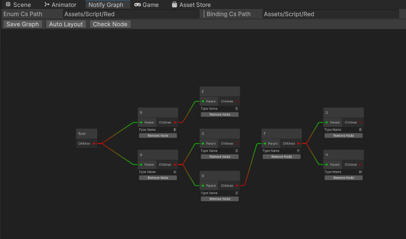

# 🔴 Red Dot System (Notification System)

## ✨ Key Features

1. **Modular Design**: The system is modular, making it easy to extend and maintain.
2. **Tree Structure**: Supports parent-child node relationships, where child node states affect parent nodes.
3. **Real-Time Updates**: Automatically notifies components to update displays when node states change.
4. **Lightweight & Efficient**: Uses an event-driven mechanism to minimize performance overhead.

## 🛠 Overview

- **Red Dot Display Control**: Dynamically show/hide red dots based on node states.
- **Notification Count Management**: Supports displaying notification counts and custom values.
- **Parent-Child Node Binding**: Define hierarchical relationships where child nodes influence parent states.
- **Event Registration & Callbacks**: Allows external components to register callbacks for state changes.
- **Visual Editor**: Provides a tree structure visualization and real-time debugging via `NotifyInspector`.

## 📖 Usage Guide

### 1. Define Notification Types

Declare notification types in `NotifyType.cs`:

```csharp  
public enum NotifyType  
{  
    Root = 0,  
    A,  
    B,  
    C,  
    // Add more types...  
}  
```  
------

### 2. Initialize the System

Initialize nodes and bind parent-child relationships in `NotifyManager`'s `OnInit` method:

```csharp  
private partial void BindNodes()  
{  
    SetNodeParent(NotifyType.B, NotifyType.A);  
    SetNodeParent(NotifyType.C, NotifyType.B);  
    // Add more bindings...  
}  
```  
------

### 3. Set Notification States

Use `NotifyManager.SetNotify` to update node states:

```csharp  
NotifyManager.instance.SetNotify(NotifyType.C, isOn: true, count: 10);  
```  
------

### 4. Register Callbacks

Register callbacks in components that need to listen for state changes:

```csharp  
NotifyManager.instance.Register(NotifyType.C, OnNotifyChanged);  
```  
------

### 5. Use the `Notifier` Component

Attach the `Notifier` script to UI objects and assign a `NotifyType`. The system will automatically update red dot
displays.
------

### 6. Using the `Notify Grap` Visual Editor

`Notify Grap` provides developers with a visual editor for the red-dot (notification) tree structure.  
Open the red-dot tree view window via the menu: Tools > Notify > Editor Graph.



`Notify Grap` reads the contents of *NotifyManager_Binding.cs* (default path `Assets/UFlowFramework/Systems/NotifySystem/NotifyManager_Binding.cs`) and initializes the red-dot tree based on the existing configuration. 

#### Features

- **Visual editing**: configure parent–child relationships of notifications by connecting nodes.  
- **Configurable output paths**: change **Enum Cs Path** and **Binding Cs Path** at the top of the window to set custom output locations for `NotifyManager_Binding.cs` and `NotifyType.cs`.  
- **Automatic script generation**: clicking *Save Graph* converts the configured tree into C# code and writes `NotifyManager_Binding.cs` and `NotifyType.cs`.  
- **Duplicate node check**: node name collisions are checked when saving.
------

### 7. Use the `NotifyInspector` Tool

`NotifyInspector` provides a visual tree structure and real-time debugging.
------

#### Open the Tool

In the Unity Editor, navigate to **`Tools > Notify TreeView Window`**.

#### Features

- **Tree Structure Visualization**: Displays parent-child relationships.
- **Real-Time State Updates**: Shows `IsOn` status, notification count, and custom values.
- **Refresh Button**: Manually refresh the view.
- **Search Functionality**: Quickly locate nodes via the search bar.

#### Use Cases

- Debug parent-child relationships.
- Inspect real-time node states and value changes.
- Troubleshoot problematic nodes.

## ⚠ Important Notes

1. **Avoid Circular Dependencies**: Ensure no loops exist in parent-child bindings.
2. **Child-Driven States**: Nodes with children should not be set directly; their states are driven by child nodes.
3. **Event Unregistration**: Call `UnRegister` when objects are destroyed to prevent memory leaks.
4. **Root Node**: `NotifyType.Root` is the default root node and should not be modified directly.

## 🎯 Example Code

Below is a complete usage example:

```csharp  
NotifyManager.instance.SetNotify(NotifyType.B, isOn: true, count: 5);  
NotifyManager.instance.Register(NotifyType.B, (isOn, count, value) =>  
{  
    Debug.Log($"NotifyType.B - isOn: {isOn}, count: {count}, value: {value}");  
});  
```  

By following these steps, you can seamlessly integrate the Red Dot System to enhance user experience in your game.