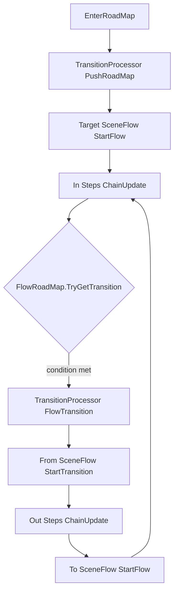

# FlowSystem

## Overview

FlowSystem is used to describe and drive a scene-flow state machine.

It organizes gameplay flow into three layers:

- `FlowRoadMap`: defines available `SceneFlow` nodes and transition conditions between them.
- `SceneFlow`: represents one flow node, with enter steps (in steps) and exit steps (out steps).
- `FlowStep`: the smallest execution unit for concrete actions (load assets, open UI, play BGM, load scene, etc.).

The system is driven by `FlowManager` and supports:

- Condition-based automatic transitions
- Forced transition to a specific `SceneFlow`
- RoadMap push/pop behavior
- Failure rollback and recovery
- Context-driven control through `FlowContext` blackboard values and triggers

---

## Core Objects

| Object | Responsibility |
|---|---|
| `FlowManager` | Global flow driver. Manages active RoadMap stack and transition processor queue. |
| `FlowRoadMap` | Flow graph. Stores `SceneFlow` nodes and conditional transition edges. |
| `SceneFlow` | One flow node, including in steps and out steps. |
| `FlowContext` | Runtime context with blackboard values, triggers, and completion/failure status. |
| `FlowStepBase` | Base class for custom flow steps. |
| `TransitionProcessor` | Executes full transition from current flow to target flow. |

---

## Execution Pipeline



`FlowManager.Execute(dt)` advances the system every frame:

1. If transitioning: run source flow exit first, then target flow enter.
2. If not transitioning: transitions can be triggered by `TryTriggerTransition()`.
3. If transition fails: rollback logic tries to recover a stable flow state.

---

## Quick Start

### 1. Create Context and SceneFlows

```csharp
var context = new FlowContext();

var bootFlow = new SceneFlow("BootFlow");
var lobbyFlow = new SceneFlow("LobbyFlow");
var battleFlow = new SceneFlow("BattleFlow");
```

### 2. Add Steps to SceneFlows

```csharp
// BootFlow enter steps: prepare config, preload assets, open loading window
var loader = AssetUtils.SpawnLoader("BootFlowLoader");

bootFlow.AddStep(new PrepareConfigStep(
    failFlowOnLoadFailed: true,
    stepName: "PrepareConfig",
    // Put your config collections here
    // new CommonConfigCollections(), new RoleConfigCollections()
    configs: new IConfBaseCollections[] { }
));

bootFlow.AddStep(new LoadAssetsStep(
    loader,
    failOnAnyError: true,
    loadMode: LoadAssetsMode.BatchSync,
    stepName: "PreloadAssets",
    "UI/LoadingWindow",
    "Audio/BGM/Main"
));

bootFlow.AddStep(new OpenWindowStep<LoadingWindow>(
    data: null,
    waitUntilOpened: false,
    closeOnExit: true,
    stepName: "OpenLoadingWindow"
));

// BootFlow exit step: load lobby scene
bootFlow.AddTransitionStep(new LoadSceneStep(
    sceneName: "Lobby",
    unloadOtherScene: true,
    waitUntilLoaded: true,
    failFlowOnLoadFailed: true,
    stepName: "LoadLobbyScene"
));

// LobbyFlow enter steps: push page and play BGM
lobbyFlow.AddStep(new PushPageStep<MainPage>(
    data: null,
    pushMode: PagePushMode.CloseOther,
    waitUntilTop: false,
    closeOnExit: false,
    stepName: "PushMainPage"
));

lobbyFlow.AddStep(new PlayBGMStep(
    clipRef: "Audio/BGM/Lobby",
    group: MusicGroup.MainScene,
    stepName: "PlayLobbyBGM"
));
```

### 3. Build RoadMap and Configure Transitions

```csharp
var roadMap = new FlowRoadMap(context, "GameMainRoadMap")
    .AddFlow(bootFlow, asEntry: true)
    .AddFlow(lobbyFlow)
    .AddFlow(battleFlow)
    .AddTransition(bootFlow, lobbyFlow, c => c.isFlowCompleted)
    .AddTransition(lobbyFlow, battleFlow, c => c.CheckTrigger("EnterBattle"));
```

### 4. Start and Drive

```csharp
FlowManager.instance.EnterRoadMap(roadMap);

// Drive from your module/game loop
FlowManager.instance.Execute(UnityEngine.Time.deltaTime);
```

### 5. Trigger Transitions at Runtime

```csharp
// Option 1: use trigger values checked by AddTransition condition
FlowManager.instance.SetContextTrigger("EnterBattle", true);

// Option 2: write context values then trigger condition check
FlowManager.instance.SetContextValue("BattleState", BattleState.Enter, shared: false);

// Option 3: force transition by target flow id
FlowManager.instance.ForceTransition(battleFlow.id);
```

---

## Built-In Steps

Current built-in steps for flow orchestration:

- `PrepareConfigStep`: loads config groups and can fail the flow on load failure.
- `LoadAssetsStep`: supports single-load direct mode, chained mode, and batch sync mode.
- `LoadSceneStep`: loads Unity scenes with optional wait and fail behavior.
- `OpenWindowStep<T>`: opens a UI window, optional close-on-exit.
- `PushPageStep<T>`: pushes a page, optional close-on-exit.
- `PlayBGMStep`: plays background music.
- `BlockUIInputStep`: opens a mask window to block UI input.

---

## Recommended Practices

1. Put failure-prone initialization steps first in enter flow (config, critical assets, scene loading).
2. Keep transition conditions based on `FlowContext` values/triggers to reduce UI coupling.
3. Use `FlowManager.SetContextValue` for key state updates to centralize transition triggers.
4. Manage `IAssetLoader` lifecycle externally when using `LoadAssetsStep`.
5. Use semantic `SceneFlow` names (`BootFlow`, `LobbyFlow`, `BattleFlow`) for easier debugging.

---

## Notes

1. `FlowManager.Execute(dt)` must be called continuously, otherwise the flow will not advance.
2. `FlowRoadMap` must have an `entryFlow` before entering the roadmap.
3. In-steps and out-steps are chain-driven by default; next step starts only after current step completes.
4. Calling `Fail(context)` in a step makes the current processor enter failed state.
5. `FlowContext.CompleteFlow()` and `FailFlow()` are mutually guarded.
6. `FlowManager.OnGameReset()` clears shared blackboard values and roadmap runtime stack.

---

## Minimal Runnable Example

```csharp
public class FlowBootstrap : UnityEngine.MonoBehaviour
{
    private IFlowRoadMap _roadMap;

    private void Start()
    {
        var context = new FlowContext();

        var boot = new SceneFlow("Boot");
        var lobby = new SceneFlow("Lobby");

        boot.AddStep(new DelayFlowStep(0.2f, "BootDelay"));
        boot.AddTransitionStep(new LoadSceneStep("Lobby", unloadOtherScene: true));

        lobby.AddStep(new PushPageStep<MainPage>(stepName: "OpenMainPage"));

        _roadMap = new FlowRoadMap(context, "MainRoadMap")
            .AddFlow(boot, asEntry: true)
            .AddFlow(lobby)
            .AddTransition(boot, lobby, c => c.isFlowCompleted);

        FlowManager.instance.EnterRoadMap(_roadMap);
    }

    private void Update()
    {
        FlowManager.instance.Execute(UnityEngine.Time.deltaTime);
    }
}
```
