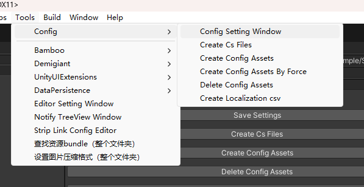
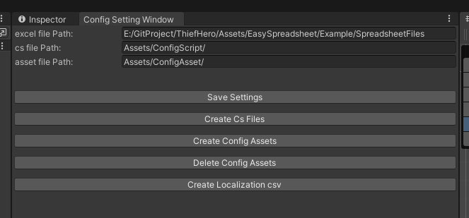
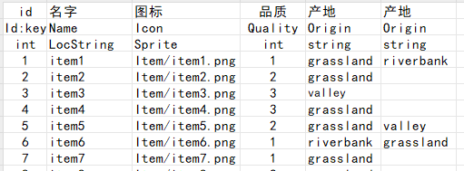
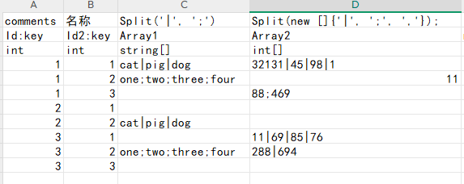

# Configuration Sheet Tool User Manual

## 📖 Introduction
This tool is a Unity-based configuration sheet management tool that supports generating configuration data from Excel files and saving/loading in multiple formats (e.g., ScriptableObject, JSON, binary). It also includes localization features, allowing localized strings to be exported as CSV files.

## ⚙️ Features
1. **Configuration Sheet Generation**
    - Generate configuration data from Excel files.
    - Supports multiple data types (e.g., `int`, `float`, `string`, `bool`).
    - Supports array types (e.g., `int[]`, `float[]`).
    - Supports localized strings and asset references.
    - Extendable with custom types.

2. **Multiple Storage Formats**
    - Save configuration data as ScriptableObject, JSON, or binary formats.
    - *Note*: ScriptableObject may not support complex structures (e.g., `List<Array>`). Use JSON or binary formats for such cases.
    - JSON and binary files are encrypted during generation and decrypted at runtime.

3. **Localization Support**
    - Automatically extracts localized strings and assets from configurations.
    - Exports localization data to CSV files.

4. **Asynchronous Loading**
    - Supports asynchronous loading for large-scale configuration sheets.

5. **Automatic Code Generation**
    - Generates C# classes and management scripts for configuration sheets.

## 📂 File Structure
- `ConfigSettingWindow.cs`  
  Provides a settings window for configuring Excel paths, generated script paths, and asset paths.

- `ConfigWriter.cs`  
  Generates C# classes and data files from Excel sheets.

- `ExcelReader.cs`  
  Reads and parses Excel files.

- `ConfBase.cs`  
  Defines base configuration classes and collections.

- `ConfAsyncLoadHandle.cs`  
  Handles asynchronous loading of configuration data.

- `AssetRef` Folder  
  Defines asset reference types (e.g., `AudioRef`, `SpriteRef`, `LocalizationStringRef`).

## 🛠️ Usage

### 📁 1. Configure Paths
Open the Unity menu `Tools > Config > Config Setting Window` and set the following paths:  


- **Excel Path**: Folder containing Excel configuration sheets.
- **Script Path**: Output path for generated C# scripts (relative to `Assets`).
- **Asset Path**: Output path for generated configuration assets (relative to `Assets`).

### 📜 2. Generate Configuration Sheets
  
In the `Config Setting Window`:
- **Save Settings**: Save current configurations.
- **Create Cs Files**: Generate C# classes from Excel files.
- **Create Config Assets**: Generate configuration data files.
- **Delete Config Assets**: Delete generated configuration assets.

### 🌐 3. Localization Support
- **Create Localization CSV**: Extract localized strings (of type `LocString`) and generate CSV files.

### 📥 4. Load Configurations
Use the `ConfigGroup` class to load configurations and clear cached data when needed:
```csharp
// Event-based loading
public void LoadConfig()
{
    ConfigGroup<CommonConfigLoader> configGroup = new ConfigGroup<CommonConfigLoader>(ConfigManager.instance.guidanceConf);
    configGroup.Append(ConfigManager.instance.rolePropConf);
    configGroup.onLoadCompleted += OnInitConfLoadCompleted;
    configGroup.LoadAll();
}

void OnInitConfLoadCompleted(AssetLoadStatus status)
{
    if (status == AssetLoadStatus.Loaded)
    {
        Debug.Log("Config loaded successfully");
    }
    else
    {
        Debug.LogError("Config loading failed");
    }
}

// Coroutine-based loading
public void LoadConfigCoroutine()
{
    CoroutineRunner.StartCoroutine(LoadConfigCoroutineHandle());
}

IEnumerator LoadConfigCoroutineHandle()
{
    ConfigGroup<CommonConfigLoader> configGroup = new ConfigGroup<CommonConfigLoader>(ConfigManager.instance.guidanceConf);
    configGroup.Append(ConfigManager.instance.rolePropConf);
    configGroup.onLoadCompleted += OnInitConfLoadCompleted;
    yield return configGroup.LoadAll();

    if (configGroup.loadStatus == AssetLoadStatus.Loaded)
    {
        Debug.Log("Config loaded successfully");
    }
    else
    {
        Debug.LogError("Config loading failed");
        string[] failed = configGroup.failLoadConfigs;
        foreach (var configName in failed)
        {
            Debug.LogError($"{configName} failed to load");
        }
    }

    // Clear cache and reload if needed
    configGroup.ReleaseAll();
}
```

### 📊 5. Access Configuration Data
Use `ConfigManager` to retrieve configuration data:
```csharp
// Get specific config by key
RolePropConf roleConfig = ConfigManager.instance.rolePropConf.Get(roleId);
Debug.Log($"Role Name: {roleConfig.name}");

// Get all config data
List<RolePropConf> roleConfigList = ConfigManager.instance.rolePropConf.rawData;
foreach (var conf in roleConfigList)
{
    Debug.Log($"Role Name: {conf.name}");
}

// Filter data
List<RolePropConf> matched = roleConfigList.Where(o => o.atk > 10 && o.atk < 20).ToList();
...
```

### 🔧 6. Extend Custom Types
Example: `TimeDateRef` converts a string to a `TimeDate` object:
```csharp
[Serializable]
public abstract class TypeRef
{
    public abstract bool IsMatch(string lowerRawType);
    public abstract string TypeName();
}

[Serializable]
public sealed class TimeDateRef : TypeRef
{
    public override bool IsMatch(string lowerRawType)
    {
        return lowerRawType.Equals("timedate");
    }

    public override string TypeName()
    {
        return "TimeDate";
    }

    public static TimeDate Parse(string stringValue, string confName, int rowIndex, int colIndex)
    {
        if (string.IsNullOrEmpty(stringValue))
            return default;

        string[] splitString = stringValue.Split('-');
        int year = int.Parse(splitString[0]);
        int month = int.Parse(splitString[1]);
        int day = int.Parse(splitString[2]);

        return new TimeDate(year, month, day);
    }
}
```  
In Excel, use the type `TimeDate` and provide data in `yyyy-mm-dd` format.

## 📑 Excel File Format
1. **Row 1**: Field descriptions (comments).
2. **Row 2**: Field names (use `:key` to mark primary keys).
3. **Row 3**: Field types (e.g., `int`, `string`, `float[]`).
4. **Rows 4+**: Data.

Example:  
| Description | id       | Name       | Values    |  
|-------------|----------|------------|-----------|  
| Field Name  | id:key   | name       | value     |  
| Field Type  | int      | string     | float[]   |  
| Data        | 1        | Hero       | 10,20,30  |  
| Data        | 2        | Monster    | 5,15,25   |

  


## ⚠️ Notes
1. Excel files must be saved as `.xlsx`.
2. Mark primary keys with `:key` (supports multiple keys).
3. Use `LocalizationStringRef` or `LocalizationAssetRef` for localized fields.
4. Duplicate field names are allowed (if types match), and will be converted to `List<T>`.

## 📦 Dependencies
- Unity 2020.3 or later.
- [EPPlus](https://github.com/EPPlusSoftware/EPPlus) for Excel parsing.
- [Newtonsoft.Json](https://www.newtonsoft.com/json) for JSON serialization.

## ❓ FAQ
1. **Config loading fails**  
   Verify path settings and Excel file format.

2. **Localized strings not exported**  
   Ensure fields use `LocString` or `LocAsset` (case-insensitive).

3. **Missing fields in generated classes**  
   Check Excel field names and types.

4. **Changes to scripts not reflected in assets**  
   The tool skips unmodified Excel files. Use **Delete Config Assets** or manually delete assets to force regeneration.