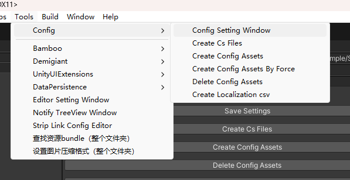
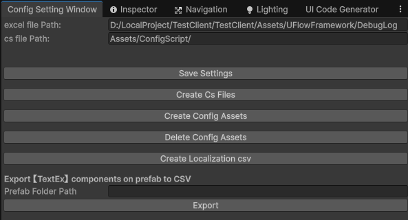
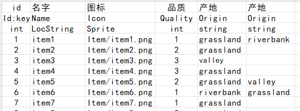
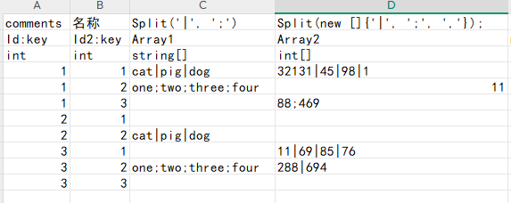

# Configuration Sheet Tool Guide

## 📖 Introduction

The current configuration system has been upgraded to a DataChunk-based chunked binary loading solution.

The configuration tool generates the following content from Excel sheets:

- C# data classes and collection classes for configuration tables
- `ConfigManager` access entry points
- one chunked binary data file per table: `ConfNameData.bytes`
- one index file per table: `ConfNameIndex.bytes`

At runtime, configuration tables no longer rely on loading the entire table into memory at once. Instead, data is accessed through `ChunkDataQueryer<TKey, TData>`, which locates chunks by key and reads data on demand. This approach is better suited for large configuration tables, on-demand access, and asynchronous initialization workflows.

## ⚙️ Features

1. **Configuration Sheet Generation**
   - Generates configuration data from Excel files.
   - Supports common primitive types, array types, asset references, and localization reference types.
   - Supports custom field types through `TypeRef` extensions.

2. **DataChunk Binary Output**
   - Each configuration table is exported as two files: `Data.bytes + Index.bytes`.
   - Uses chunk indexes for fast key-based lookup and on-demand loading.
   - Configuration access APIs have been unified around `Get`, `GetByKey`, `GetAll`, and `Find`.

3. **Asynchronous and On-Demand Loading**
   - Supports synchronous `Prepare()` and asynchronous `PrepareAsync()`.
   - Supports batch asynchronous loading of multiple configuration collections through `ConfigGroup`.
   - On first launch, configuration binaries can be copied from packaged resources into the persistent directory.

4. **Localization and Asset References**
   - Supports types such as `LocalizationStringRef` and `LocalizationAssetRef`.
   - Supports asset reference types such as `AudioRef`, `SpriteRef`, and `GameObjectRef`.
   - Supports exporting localization CSV files.

5. **Automatic Code Generation**
   - Automatically generates configuration data classes, collection classes, creators, and `ConfigManager` accessors.

## 📂 File Structure

- `ConfigSettingWindow.cs`  
  Provides the configuration tool settings window for Excel paths, script output paths, and configuration asset output paths.

- `ConfigWriter.cs`  
  Generates C# code for configuration tables from Excel files.

- `WriteConfCreatorHandler.cs`  
  Generates configuration asset export logic. It currently uses `ChunkMaker.StreamWriteSync(...)` internally to output DataChunk files.

- `ConfBase.cs` / `ConfBaseCollections.cs`  
  Define base configuration data classes and collection loading/query APIs.

- `ConfigGroup.cs`  
  Manages asynchronous loading states for multiple configuration collections.

- `ConfigManager.cs`  
  Provides the unified configuration access entry point and handles first-time configuration file copy initialization.

- `AssetRef` folder  
  Defines extensible field types available in configuration tables, such as `AudioRef`, `SpriteRef`, and `LocalizationStringRef`.

## 🛠️ Usage

### 📁 1. Configure Paths

Open the Unity menu `Tools > Config > Config Setting Window` and configure the following paths:



- **Excel File Path**: The folder that stores Excel configuration sheets.
- **Script File Path**: The output path for generated C# scripts, relative to `Assets`.

### 📜 2. Generate Configuration Tables



In `Config Setting Window`, click the following buttons:

- **Save Settings**: Save the current settings.
- **Create Cs Files**: Generate C# classes and management code from Excel files.
- **Create Config Assets**: Generate binary configuration files.
- **Delete Config Assets**: Delete generated binary configuration files.

Each configuration table usually generates two files:

- `ConfNameData.bytes`: chunked data file
- `ConfNameIndex.bytes`: chunk index file

### 🌐 3. Localization Support

- **Create Localization csv**: Extract localized strings and assets from configuration tables and generate CSV files.

### 🚀 4. Initialize Configuration Resources

At runtime, call `ConfigInitTool.CopyConfigToPersistentDataPath()` first if needed. The current logic copies packaged configuration binaries into `{Application.persistentDataPath}/ConfigAsset/` on first launch. Configuration collections then load files from the persistent directory.

```csharp
IEnumerator Start()
{
    yield return ConfigInitTool.CopyConfigToPersistentDataPath();
}
```

### 📥 5. Load Multiple Configurations

Use `ConfigGroup` to load multiple configuration collections together:

```csharp
private ConfigGroup _configGroup;

IEnumerator LoadConfig()
{
    _configGroup = new ConfigGroup(
        ConfigManager.instance.guidanceConf,
        ConfigManager.instance.rolePropConf);

    _configGroup.onLoadCompleted += OnInitConfLoadCompleted;
    yield return _configGroup.LoadAll();
}

private void OnInitConfLoadCompleted(AssetLoadStatus status)
{
    if (status == AssetLoadStatus.Loaded)
    {
        Debug.Log("Configuration loaded successfully");
        return;
    }

    Debug.LogError("Configuration loading failed");
    string[] failed = _configGroup.failLoadConfigs;
    for (int i = 0; i < failed.Length; i++)
    {
        Debug.LogError($"{failed[i]} failed to load");
    }
}

void ReleaseConfig()
{
    _configGroup?.ReleaseAll();
}
```

### 📦 6. Load a Single Table Synchronously

If only one table is needed, call `Prepare()` directly on the collection class:

```csharp
ConfigManager.instance.rolePropConf.Prepare();

RolePropConf roleConfig = ConfigManager.instance.rolePropConf.Get(roleId);

ConfigManager.instance.rolePropConf.Release(false);
```

### 📊 7. Access Configuration Data

The recommended access patterns are:

```csharp
// Get a single record by key
RolePropConf roleConfig = ConfigManager.instance.rolePropConf.Get(roleId);
Debug.Log($"Role name: {roleConfig.name}");

// Filter by key predicate
foreach (var conf in ConfigManager.instance.rolePropConf.GetByKey(id => id > 1000))
{
    Debug.Log($"Matched By Key: {conf.name}");
}

// Enumerate the full table
foreach (var conf in ConfigManager.instance.rolePropConf.GetAll())
{
    Debug.Log($"All: {conf.name}");
}

// Filter by data predicate
foreach (var conf in ConfigManager.instance.rolePropConf.Find(o => o.atk > 10 && o.atk < 20))
{
    Debug.Log($"Matched By Predicate: {conf.name}");
}
```

Full-table cache interfaces such as `rawData` are no longer the primary recommended approach in the current DataChunk solution. Prefer the query APIs above.

### 🔧 8. Extend Custom Types

Custom field types must inherit from `TypeRef` and provide at least:

- `isMatch(string lowerRawType)`
- `TypeName()`
- static `Parse(...)`
- static `WriteItemData(...)`
- static `ReadItemData(...)`

Example: `TimeDateRef`

```csharp
using System;
using System.IO;
using System.Text;

[Serializable]
public sealed class TimeDateRef : TypeRef
{
    public override bool isMatch(string lowerRawType)
    {
        return lowerRawType.Equals("timedate");
    }

    public override string TypeName()
    {
        return "TimeDate";
    }

    public static TimeDate Parse(string stringValue, string confName, int rowIndex, int colIndex)
    {
        if (string.IsNullOrEmpty(stringValue))
            return default;

        string[] splitString = stringValue.Split('-');
        int year = int.Parse(splitString[0]);
        int month = int.Parse(splitString[1]);
        int day = int.Parse(splitString[2]);
        return new TimeDate(year, month, day);
    }

    public static void WriteItemData(TimeDate item, BinaryWriter writer, Encoding encoding)
    {
        writer.Write(item.Year);
        writer.Write(item.Month);
        writer.Write(item.Day);
    }

    public static TimeDate ReadItemData(BinaryReader reader, Encoding encoding)
    {
        int year = reader.ReadInt32();
        int month = reader.ReadInt32();
        int day = reader.ReadInt32();
        return new TimeDate(year, month, day);
    }
}
```

Then use `TimeDate` as the field type in Excel and provide data in the correct format.

### 🔧 9. Read Configuration Tables in the Editor

For editor tools, if you only need to read one configuration table temporarily, synchronous `Prepare()` is usually more direct:

```csharp
var configInstance = new ConfigManager();
configInstance.guidanceConf.Prepare();

var guidanceConfig = configInstance.guidanceConf.Get(1);

configInstance.guidanceConf.Release(false);
```

-------------

## 📑 Excel File Format

1. **Row 1**: Field comments.
2. **Row 2**: Field names. Use `:key` to mark primary keys. Multiple keys are supported.
3. **Row 3**: Field types, such as `int`, `string`, `float[]`, `LocalizationStringRef`, and so on.
4. **Rows 4+**: Data rows.

Example:

| Description | id | Name | Values |
|---|---|---|---|
| Field Name | id:key | name | value |
| Field Type | int | string | float[] |
| Data | 1 | Hero | 10,20,30 |
| Data | 2 | Monster | 5,15,25 |





## ⚠️ Notes

1. Excel files must be saved as `.xlsx`.
2. Primary key fields must be marked with `:key`. Multiple keys are supported.
3. The current configuration system exports DataChunk binary files instead of the old multi-format configuration assets.
4. Use `LocalizationStringRef` or `LocalizationAssetRef` for localization fields.
5. Field names can be duplicated, but their field types must be identical. Duplicate fields will be generated as `List<T>`.
6. In addition to `Parse`, custom `TypeRef` implementations must provide `WriteItemData` / `ReadItemData`, otherwise generated configuration classes cannot complete binary read/write operations.
7. If runtime depends on first-time configuration file copying, make sure the generated configuration assets have been correctly packaged into loadable runtime resources.
8. If only export scripts are modified while Excel content remains unchanged, the exporter may skip regeneration because the Excel MD5 has not changed. Delete old configuration assets before exporting again if needed.

## 📦 Dependencies

- Unity 2020.3 or later.
- [EPPlus](https://github.com/EPPlusSoftware/EPPlus) for parsing Excel files.
- DataChunk binary loading/serialization tools for configuration export and runtime queries.

## ❓ FAQ

1. **Configuration loading fails**  
   Check the Excel export path, runtime persistent directory, and whether generated `Data.bytes` / `Index.bytes` files exist.

2. **Configuration files are not copied on first launch**  
   Check whether configuration assets have been correctly packaged into runtime-loadable resources and whether the initialization flow has executed `ConfigManager.Init(...)`.

3. **Localized strings are not exported correctly**  
   Make sure fields use `LocString` / `LocAsset` or the corresponding `LocalizationStringRef` / `LocalizationAssetRef` mapping types.

4. **Generated configuration class fields are missing or have incorrect types**  
   Check Excel field names, field types, key markers, and duplicate field definitions.

5. **Changes to export scripts are not reflected in generated configuration assets**  
   To speed up generation, the tool checks Excel MD5 values. If only scripts are changed while Excel content is unchanged, the current table may be skipped. Use **Delete Config Assets** in `Config Setting Window`, or manually delete old `.bytes` files before exporting again.
