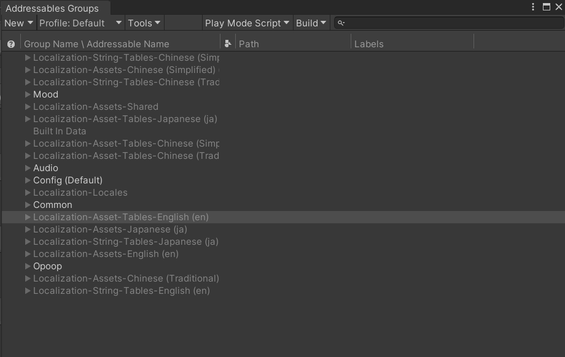
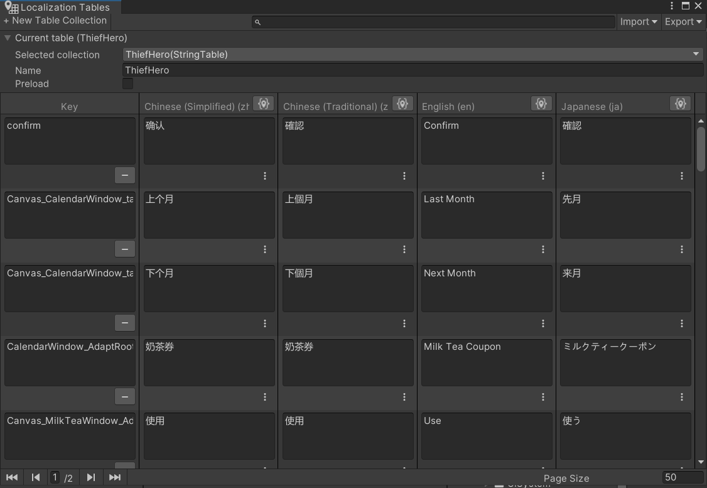
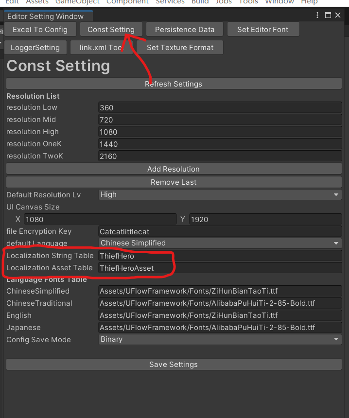

# 快速开始

## 1. 导入框架

将框架文件夹复制到 Unity 项目的 `Assets` 目录下。

## 2. 配置 `Addressable` 和 `Localization` 插件

Addressable 配置参考： [https://docs.unity.cn/Packages/com.unity.addressables@1.14/manual/AddressableAssetsGettingStarted.html](https://docs.unity.cn/Packages/com.unity.addressables@1.14/manual/AddressableAssetsGettingStarted.html)

Localization 配置参考： [https://docs.unity.cn/Packages/com.unity.localization@1.3/manual/LocalizationSettings.html](https://docs.unity.cn/Packages/com.unity.localization@1.3/manual/LocalizationSettings.html)

检查 `Window > Asset Management > Addressables` 菜单是否存在


确认 `Window > Asset Management > Localization Tables` 配置面板


## 3. 配置 `ConstSetting`

选择 `Tools > Editor Setting Window` 打开 *Editor Setting Window* ，选择 *Const Setting* 选项可以对 `ConstSetting` 进行配置



需要注意：
 - **LocalizationStringTable** 选项的 本地化字符串配置 需要和 *Localization Tables* 配置的一致；
 - **LocalizationAssetTable** 选项的 本地化资源配置 需要和 *Localization Tables* 配置的一致；

## 4. 搭建入口场景

框架内配置了入口场景的预设：
选择项目内的文件 [****/UFlowFramework/MainPreset/MainPreset.unitypackage](../../MainPreset/MainPreset.unitypackage) 点击导入预制体

将 `Main.prefab` 拖放进场景中，之后可以开始编写入口脚本。

## 5. 编写入口脚本

新建脚本（以`TestMain`为例）继承`SceneMainBase`，并实现`ReadyForStart()`方法，`ReadyForStart()`
被调用时，系统已经实现了资源系统初始化、模块中枢初始化、配置表工具和多语言功能初始化。
之后根据自身项目需要，调用需要的逻辑开始游戏进程。
以下为举例：

```csharp
using PowerCellStudio

namespace YourNameSpace
{
    public class TestMain : SceneMainBase
    {
        protected override void Awake()
        {
            // 可以在初始化前执行需要的逻辑
            // do something
            base.Awake();
        }

        protected void ReadyForStart()
        {
            // 可以在初始化后执行需要的逻辑
            // do something

            // 新建Page容器
            UIManager.instance.PushPage<LoginPage>();
            // 打开登陆界面
            UIManager.instance.OpenWindow<LoginWindow>();
        }
    }
}
```

之后在场景上新建gameObject，将`TestMain`组件添加到gameObject上，这就完成了框架功能的初始化 。

你可以在`TestMain`脚本中实现游戏的启动逻辑，或者在其他脚本中调用`UIManager`来打开不同的页面和窗口。