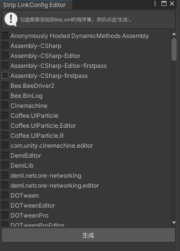

# 🚀 逻辑功能工具

## 1. 随机数工具 Randomizer

`Randomizer` 是一个随机数工具类，提供了多种随机数生成和随机抽取的方法，适用于各种场景。

### 功能

- **SetSeed**: 设置随机数种子。
- **Value01**: 获取 [0, 1) 范围内的随机浮点数。
- **Range**: 获取指定范围内的随机整数或浮点数。
- **RandomLong**: 生成随机的 `long` 类型值。
- **True**: 根据概率返回布尔值。
- **RandomSelection**: 从列表或数组中随机抽取一个元素。
- **WeightedRandomSelection**: 根据权重从列表或字典中随机抽取一个元素。
- **RandomSelectionWithoutDuplicates**: 从列表或数组中随机抽取指定数量的元素，且不重复。
- **WeightedRandomSelectionWithoutDuplicates**: 根据权重从字典中随机抽取指定数量的元素，且不重复。

### 使用方法

#### 基本随机数生成

```csharp
Randomizer.SetSeed(42); // 设置随机种子
float randomValue = Randomizer.Value01(); // 获取 [0, 1) 范围内的随机值
int randomInt = Randomizer.Range(1, 10); // 获取 [1, 10) 范围内的随机整数
long randomLong = Randomizer.RandomLong(); // 获取随机 long 值
```

#### 随机抽取

```csharp
var elements = new[] { "A", "B", "C" };
string randomElement = Randomizer.RandomSelection(elements); // 随机抽取一个元素
```

#### 带权重的随机抽取

```csharp
var items = new Dictionary<string, int> { { "A", 10 }, { "B", 20 }, { "C", 30 } };
string weightedElement = Randomizer.WeightedRandomSelection(items); // 根据权重随机抽取一个元素
```

#### 不重复随机抽取

```csharp
var list = new List<int> { 1, 2, 3, 4, 5 };
var uniqueSelection = Randomizer.RandomSelectionWithoutDuplicates(list, 3); // 随机抽取 3 个不重复的元素
```

#### 带权重的不重复随机抽取

```csharp
var weightedItems = new Dictionary<string, int> { { "A", 10 }, { "B", 20 }, { "C", 30 } };
var uniqueWeightedSelection = Randomizer.WeightedRandomSelectionWithoutDuplicates(weightedItems, 2); // 随机抽取 2 个不重复的元素
```

---

## 2. 寻路工具

### AStar

`AStar` 是一个基于 A* 算法的寻路工具，支持网格地图的路径搜索。它提供以下功能：

- **Path**: 计算从起点到终点的路径。
- **SetGround**: 设置地图的可行走区域。
- **支持六边形网格**: 可切换为六边形网格模式。

#### 使用方法

1. 创建 `AStar` 实例并设置地图的可行走区域。
2. 调用 `Path` 方法计算路径。

```csharp
var astar = new AStar();
astar.SetGround(grounds, Vector2Int.one);
List<Vector2Int> path = astar.Path(startPos, endPos);
```

---

### JPS

`JPS` 是一个基于跳点搜索 (Jump Point Search) 算法的寻路工具，适用于大规模网格地图的快速路径搜索。它提供以下功能：

- **GetPath**: 计算从起点到终点的路径。
- **initMap**: 初始化地图的可行走区域。

#### 使用方法

1. 创建 `JPS` 实例并初始化地图的可行走区域。
2. 调用 `GetPath` 方法计算路径。

```csharp
var jps = new JPS();
jps.initMap(grounds);
List<Point> path = jps.GetPath(startPos, endPos);
```

---

## 3. RVO避障算法

`RVO` 是一个基于 Reciprocal Velocity Obstacles (RVO) 算法的避障工具，适用于多智能体的动态避碰场景。它提供以下功能：

- **多智能体避障**：支持多个智能体在动态环境中的避碰行为。
- **静态障碍物支持**：智能体会根据静态障碍物调整路径。
- **高效的邻居查询**：通过 KdTree 加速邻居检测。
- **多线程支持**：可选的多线程实现，提升大规模场景的计算效率。

### 使用方法

#### 初始化模拟器

1. 创建 `Simulator` 实例。
2. 设置默认智能体属性。
3. 添加智能体和障碍物。

```csharp
var simulator = new RVO.Simulator();
simulator.setAgentDefaults(15.0f, 10, 5.0f, 5.0f, 1.5f, 2.0f, Vector3.zero);

int agentId = simulator.addAgent(new Vector3(0, 0, 0));
simulator.addObstacle(new List<Vector3> { new Vector3(1, 0, 1), new Vector3(1, 0, -1) });
simulator.processObstacles();
```

#### 执行模拟

1. 设置智能体的目标速度。
2. 调用 `doStep` 方法执行模拟步骤。

```csharp
simulator.setAgentPrefVelocity(agentId, new Vector3(1, 0, 0));
float time = simulator.doStep();
```

#### 获取智能体状态

通过以下方法获取智能体的状态：

- **位置**：`getAgentPosition(agentId)`
- **速度**：`getAgentVelocity(agentId)`

```csharp
Vector3 position = simulator.getAgentPosition(agentId);
Vector3 velocity = simulator.getAgentVelocity(agentId);
```

---

# UI组件

## 1. ButtonEx

### ButtonEx 功能和使用方法

`ButtonEx` 是一个扩展自 Unity `Button` 的自定义 UI 组件，提供了额外的功能，如长按检测和长按重复触发事件。它适用于需要增强交互功能的按钮场景。

---

### 功能

1. **长按检测**：
    - 支持检测按钮的长按操作。
    - 可设置长按触发的时间阈值。

2. **长按重复触发**：
    - 支持在长按状态下以固定间隔重复触发事件。

3. **长按事件**：
    - `onLongPress`：长按触发的事件。
    - `onLongPressUp`：长按结束时触发的事件。

4. **自定义属性**：
    - `enableLongPress`：是否启用长按功能。
    - `longPressRepeat`：是否启用长按重复触发。
    - `longPressStartTime`：长按开始的时间阈值。
    - `longPressTriggerTime`：长按触发的时间阈值。
    - `longPressIntervalTime`：长按重复触发的时间间隔。

---

### 使用方法

#### 1. 添加 ButtonEx 到场景

- 在 Unity 编辑器中，右键点击层级视图，选择 `GameObject > UI > ButtonEx`，即可添加一个 `ButtonEx` 组件。

#### 2. 设置长按功能

- 在 `Inspector` 面板中，勾选 `Enable Long Press`。
- 配置以下参数：
    - `Long Press Start Time`：设置判断长按开始的时间阈值（单位：秒），按下达到这个时间后，`onClick` 事件将无法触发。
    - `Long Press Trigger Time`：设置长按触发的时间阈值（单位：秒），达到这个时间后将触发 `onLongPress` 事件。
    - `Long Press Interval Time`（可选）：设置长按重复触发的时间间隔（单位：秒），达到长按触发时间后，每隔X秒重复触发
      `onLongPress` 事件。

#### 3. 绑定事件

- 在 `Inspector` 面板中，展开 `On Long Press` 和 `On Long Press Up`，绑定需要触发的事件。

#### 4. 示例代码

```csharp
using UnityEngine;

public class ButtonExExample : MonoBehaviour
{
    public ButtonEx buttonEx;

    private void Start()
    {
        buttonEx.onLongPress.AddListener(OnLongPress);
        buttonEx.onLongPressUp.AddListener(OnLongPressUp);
    }

    private void OnLongPress()
    {
        Debug.Log("Button is being long-pressed!");
    }

    private void OnLongPressUp()
    {
        Debug.Log("Button long-press released!");
    }
}
```

### 注意事项

- 如果启用了长按功能，短按事件（如 `OnClick`）将在长按开始后被屏蔽。
- 可通过 `ButtonExEditor` 快速添加音效触发器（如按下或释放时播放音效）。

---

## 2. TextLife

[TextLife](https://flowus.cn/enjoygameclub/share/fa2ac259-3498-4282-8200-3caeef47caef) 提供了一个简单的文本特效组件，支持多种文本特效效果。

详细使用方法和示例代码请参考 [TextLife 文档](https://flowus.cn/enjoygameclub/share/fa2ac259-3498-4282-8200-3caeef47caef)。

## 3. uGUI-Hypertext

[uGUI-Hypertext](https://github.com/setchi/uGUI-Hypertext) 是一个扩展自 Unity `Text` 的自定义组件，支持在文本中嵌入超链接并响应点击事件。它适用于需要在
UI 文本中实现交互功能的场景。

详细使用方法和示例代码请参考 [uGUI-Hypertext](https://github.com/setchi/uGUI-Hypertext)

---

# 网络通信工具 Network Communication Tools

**UFlow** 提供了一套简单的网络通信工具，支持客户端与服务器之间的高效通信。以下是主要功能和使用方法：

## 功能

- **TcpGameServer**: 基于 TCP 的游戏服务器，支持多客户端连接和消息处理。
- **NetClientManager**: 客户端管理器，支持消息发送、接收和自动重连。
- **NetworkSerializer**: 提供消息的序列化和反序列化功能，支持 Protobuf 格式。
- **MessageReceiveHandler**: 消息接收处理器，支持消息监听和队列处理。

---

## 使用方法

### 1. 启动服务器

在服务器端使用 `TcpGameServer` 启动一个监听端口的 TCP 服务器。

```csharp
var server = new TcpGameServer(IPAddress.Any, 6000);
server.OnConnectedEvent += () => Debug.Log("Client connected");
server.OnDisconnectedEvent += () => Debug.Log("Client disconnected");
server.Start();
```

### 2. 客户端连接

在客户端使用 `NetClientManager` 连接到服务器。

```csharp
NetClientManager.instance.Connect();
```

### 3. 消息发送

客户端可以通过 `NetClientManager` 发送消息到服务器。

```csharp
var playerMove = new PlayerMove { X = 1, Y = 2, Z = 3 };
NetClientManager.instance.Send(playerMove);
```

### 4. 消息接收

客户端可以监听服务器返回的消息。

```csharp
NetClientManager.instance.AddMessageListener<ServerResponse>(response =>
{
    Debug.Log($"Received response: {response.Success}");
});
```

### 5. 消息队列处理

支持消息队列的发送和接收。

```csharp
var handler = NetClientManager.instance.SendQueue<ServerResponse, PlayerMove>(playerMove);
handler.AddListener(response =>
{
    Debug.Log($"Queue response: {response.Success}");
});
```

---

### 注意事项

- 确保服务器和客户端的消息类型一致。
- 使用 `NetworkSerializer` 进行消息的序列化和反序列化。
- 在客户端断开连接时，支持自动重连功能。

---

# Debug工具

## 1. TestAttributeInspector

`TestAttributeInspector` 是一个自定义的 Unity Inspector 扩展工具，支持以下功能：

- **测试按钮**：通过 `TestButtonAttribute` 自动生成按钮，点击后调用对应的方法。
- **测试滑块**：通过 `TestSliderAttribute` 自动生成滑块，滑动后调用对应的方法并传递滑块值。

### 使用方法

1. 在需要测试的方法上添加 `[TestButton]` 或 `[TestSlider]` 属性。
2. 在 Unity Inspector 面板中，查看生成的按钮或滑块。
3. 点击按钮或调整滑块以触发方法。

#### 示例代码

```csharp
using UnityEngine;
using PowerCellStudio;

public class TestExample : MonoBehaviour
{
    [TestButton("Click Me")]
    private void TestButtonMethod()
    {
        Debug.Log("Button clicked!");
    }

    [TestSlider(0, 100, 50)]
    private void TestSliderMethod(float value)
    {
        Debug.Log($"Slider value: {value}");
    }
}
```

---

## 2. SpaceAfterAttribute

`SpaceAfterAttribute` 是一个自定义属性，用于在 Unity Inspector 面板中为字段添加额外的间距。

### 使用方法

1. 在字段上添加 `[SpaceAfter]` 属性，并指定间距高度。
2. 在 Unity Inspector 面板中，字段下方会显示指定的间距。

#### 示例代码

```csharp
using UnityEngine;
using PowerCellStudio;

public class SpaceExample : MonoBehaviour
{
    [SpaceAfter(20)]
    public int exampleField;
}
```

---

## 3. link.xml 文件生成工具

`link.xml` 文件用于在 Unity 中配置 IL2CPP 的链接器行为，确保在构建时不会错误地删除未使用的代码。

通过 `Tools > Strip Link Config Editor` 打开工具窗口。



项目通过 `LinkXmlGenerator` 工具自动生成 `link.xml` 文件，支持以下功能：

- **自动生成**：根据项目中的程序集自动生成 `link.xml` 文件。
- **自定义配置**：支持自定义保留的程序集。
- **读取配置**：从配置文件中读取先前配置保留的程序集。
- **可视化**：会收集项目中使用的程序集，并在 Unity 编辑器中显示。

---

