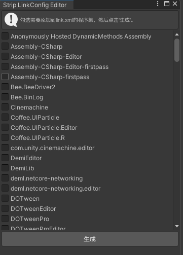

# Debug工具

## 1. TestAttributeInspector

`TestAttributeInspector` 是一个自定义的 Unity Inspector 扩展工具，支持以下功能：

- **测试按钮**：通过 `TestButtonAttribute` 自动生成按钮，点击后调用对应的方法。
- **测试滑块**：通过 `TestSliderAttribute` 自动生成滑块，滑动后调用对应的方法并传递滑块值。

### 使用方法

1. 在需要测试的方法上添加 `[TestButton]` 或 `[TestSlider]` 属性。
2. 在 Unity Inspector 面板中，查看生成的按钮或滑块。
3. 点击按钮或调整滑块以触发方法。

#### 示例代码

```csharp
using UnityEngine;
using PowerCellStudio;

public class TestExample : MonoBehaviour
{
    [TestButton("Click Me")]
    private void TestButtonMethod()
    {
        Debug.Log("Button clicked!");
    }

    [TestSlider(0, 100, 50)]
    private void TestSliderMethod(float value)
    {
        Debug.Log($"Slider value: {value}");
    }
}
```

---

## 2. SpaceAfterAttribute

`SpaceAfterAttribute` 是一个自定义属性，用于在 Unity Inspector 面板中为字段添加额外的间距。

### 使用方法

1. 在字段上添加 `[SpaceAfter]` 属性，并指定间距高度。
2. 在 Unity Inspector 面板中，字段下方会显示指定的间距。

#### 示例代码

```csharp
using UnityEngine;
using PowerCellStudio;

public class SpaceExample : MonoBehaviour
{
    [SpaceAfter(20)]
    public int exampleField;
}
```

---

## 3. link.xml 文件生成工具

`link.xml` 文件用于在 Unity 中配置 IL2CPP 的链接器行为，确保在构建时不会错误地删除未使用的代码。

通过 `Tools > Editor Setting Window` 打开工具窗口，选择 `link.xml Tool`。



项目通过 `LinkXmlGenerator` 工具自动生成 `link.xml` 文件，支持以下功能：

- **自动生成**：根据项目中的程序集自动生成 `link.xml` 文件。
- **自定义配置**：支持自定义保留的程序集。
- **读取配置**：从配置文件中读取先前配置保留的程序集。
- **可视化**：会收集项目中使用的程序集，并在 Unity 编辑器中显示。

---

## 3. Logger 脚本一键生成

UFlow 提供了一个用于自动生成自定义Logger脚本的工具，通过 `Tools > Editor Setting Window` 打开工具窗口，选择 `LoggerSetting` 打开配置。

可以对当前的Logger类型自定义配置，也可以生成新的Logger类型。

生成的logger类格式如下：

```csharp

// 类名生成规则：$"{LogType}Logger"
public static class ModuleLogger
{
    public static void Log(object message)
    {
        if(Application.isPlaying && !ApplicationManager.enableLog) return;
        Debug.Log($"[<color=#FF00DFFF>Module Log</color>] {message}");
    }

    public static void LogWarning(object message)
    {
        if(Application.isPlaying && !ApplicationManager.enableWarning) return;
        Debug.LogWarning($"[<color=#FF00DFFF>Module Warning</color>] {message}");
    }

    public static void LogError(object message)
    {
        if(Application.isPlaying && !ApplicationManager.enableError) return;
        Debug.LogError($"[<color=#FF00DFFF>Module Error</color>] {message}");
    }

    public static Exception Exception(object message)
    {
        if(Application.isPlaying && !ApplicationManager.enableError) return null;
        return new Exception($"[<color=#FF00DFFF>Module Exception</color>] {message}");
    }

    // 勾选GenericArgument时会再生成泛型方法
    public static void Log<T>(object message)
    {
        if(Application.isPlaying && !ApplicationManager.enableLog) return;
        Debug.Log($"[<color=#FF00DFFF>Module Log</color>:{typeof(T).Name}] {message}");
    }

    public static void LogWarning<T>(object message)
    {
        if(Application.isPlaying && !ApplicationManager.enableWarning) return;
        Debug.LogWarning($"[<color=#FF00DFFF>Module Warning</color>:{typeof(T).Name}] {message}");
    }

    public static void LogError<T>(object message)
    {
        if(Application.isPlaying && !ApplicationManager.enableError) return;
        Debug.LogError($"[<color=#FF00DFFF>Module Error</color>:{typeof(T).Name}] {message}");
    }

    public static Exception Exception<T>(object message)
    {
        if(Application.isPlaying && !ApplicationManager.enableError) return null;
        return new Exception($"[<color=#FF00DFFF>Module Exception</color>:{typeof(T).Name}] {message}");
    }
}

```
------