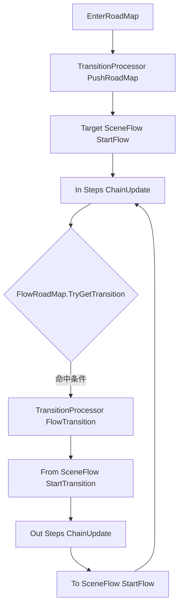

# 场景流转 FlowSystem

## 😀 概述

FlowSystem 用于描述和驱动“场景流程状态机”。

它把业务流程拆成三层：

- `FlowRoadMap`：记录有哪些 `SceneFlow`，以及它们之间何时跳转。
- `SceneFlow`：表示一个流程节点，包含进入步骤（In Steps）和退出步骤（Out Steps）。
- `FlowStep`：最小执行单元，负责具体动作（加载资源、开 UI、播 BGM、加载场景等）。

系统由 `FlowManager` 统一驱动，支持：

- 基于条件的自动跳转
- 强制跳转到指定 `SceneFlow`
- RoadMap 入栈/出栈
- 失败回退与恢复
- 基于上下文黑板值（`FlowContext`）的流程控制

---

## 🧩 核心对象

| 对象 | 作用 |
|---|---|
| `FlowManager` | 全局流程驱动器，维护当前 `RoadMap` 和过渡处理器队列。 |
| `FlowRoadMap` | 流程图，包含 `SceneFlow` 节点与条件转移边。 |
| `SceneFlow` | 一个流程节点，包含进入步骤与退出步骤。 |
| `FlowContext` | 流程上下文，提供黑板值、触发器和完成/失败状态。 |
| `FlowStepBase` | 步骤基类，派生后可实现自定义业务步骤。 |
| `TransitionProcessor` | 处理从当前 `SceneFlow` 到目标 `SceneFlow` 的完整过渡。 |

---

## 🔁 执行流程



每帧由 `FlowManager.Execute(dt)` 推进：

1. 如果正在过渡：先处理 fromFlow 的退出，再处理 toFlow 的进入。
2. 如果不在过渡：可尝试触发条件跳转（`TryTriggerTransition`）。
3. 跳转失败时会触发回退逻辑，尽量恢复到稳定状态。

---

## 🛠️ 快速上手

### 1. 创建 Context 与 SceneFlow

```csharp
var context = new FlowContext();

var bootFlow = new SceneFlow("BootFlow");
var lobbyFlow = new SceneFlow("LobbyFlow");
var battleFlow = new SceneFlow("BattleFlow");
```

### 2. 给 SceneFlow 添加步骤

```csharp
// 进入 BootFlow：加载配置、加载资源、打开加载界面
var loader = AssetUtils.SpawnLoader("BootFlowLoader");

bootFlow.AddStep(new PrepareConfigStep(
	failFlowOnLoadFailed: true,
	stepName: "PrepareConfig",
	// 这里填你的配置集合实例
	// new CommonConfigCollections(), new RoleConfigCollections()
	configs: new IConfBaseCollections[] { }
));

bootFlow.AddStep(new LoadAssetsStep(
	loader,
	failOnAnyError: true,
	loadMode: LoadAssetsMode.BatchSync,
	stepName: "PreloadAssets",
	"UI/LoadingWindow",
	"Audio/BGM/Main"
));

bootFlow.AddStep(new OpenWindowStep<LoadingWindow>(
	data: null,
	waitUntilOpened: false,
	closeOnExit: true,
	stepName: "OpenLoadingWindow"
));

// 退出 BootFlow 时切换到大厅场景
bootFlow.AddTransitionStep(new LoadSceneStep(
	sceneName: "Lobby",
	unloadOtherScene: true,
	waitUntilLoaded: true,
	failFlowOnLoadFailed: true,
	stepName: "LoadLobbyScene"
));

// 进入 LobbyFlow：推主页面并播放 BGM
lobbyFlow.AddStep(new PushPageStep<MainPage>(
	data: null,
	pushMode: PagePushMode.CloseOther,
	waitUntilTop: false,
	closeOnExit: false,
	stepName: "PushMainPage"
));

lobbyFlow.AddStep(new PlayBGMStep(
	clipRef: "Audio/BGM/Lobby",
	group: MusicGroup.MainScene,
	stepName: "PlayLobbyBGM"
));
```

### 3. 构建 RoadMap 并配置跳转条件

```csharp
var roadMap = new FlowRoadMap(context, "GameMainRoadMap")
	.AddFlow(bootFlow, asEntry: true)
	.AddFlow(lobbyFlow)
	.AddFlow(battleFlow)
	.AddTransition(bootFlow, lobbyFlow, c => c.isFlowCompleted)
	.AddTransition(lobbyFlow, battleFlow, c => c.CheckTrigger("EnterBattle"));
```

### 4. 启动与驱动

```csharp
FlowManager.instance.EnterRoadMap(roadMap);

// 由你的主循环或模块系统驱动
// 例如在 Update 中：
FlowManager.instance.Execute(UnityEngine.Time.deltaTime);
```

### 5. 运行时触发跳转

```csharp
// 方式1：写触发器，满足 AddTransition 条件
FlowManager.instance.SetContextTrigger("EnterBattle", true);

// 方式1：写黑板值，满足 AddTransition 条件
FlowManager.instance.SetContextValue("BattleState", BattleState.Enter);

// 方式2：强制跳转到指定 flowId
FlowManager.instance.ForceTransition(battleFlow.id);
```

---

## 🧱 BuiltInStep 一览

当前内置步骤可直接用于流程编排：

- `PrepareConfigStep`：加载配置组，支持失败中断 Flow。
- `LoadAssetsStep`：按单资源/链式/批量顺序加载资源。
- `LoadSceneStep`：加载 Unity 场景，支持等待完成与失败处理。
- `OpenWindowStep<T>`：打开窗口，支持退出时自动关闭。
- `PushPageStep<T>`：压入页面，支持退出时自动关闭页面。
- `PlayBGMStep`：播放背景音乐。
- `BlockUIInputStep`：打开遮罩阻塞 UI 输入。

---

## 🌟 推荐实践

1. 把“可失败的初始化动作”放在进入步骤最前面（配置、关键资源、场景加载）。
2. 所有过渡条件尽量只依赖 `FlowContext` 黑板值或触发器，避免和 UI 组件强耦合。
3. 统一从 `FlowManager.SetContextValue` 写关键状态，便于自动触发跳转。
4. `LoadAssetsStep` 的 `IAssetLoader` 由外部管理生命周期，避免在 Step 内创建临时 loader。
5. 对 `SceneFlow` 命名使用业务语义（如 `BootFlow`、`LobbyFlow`、`BattleFlow`），便于日志排查。

---

## ⚠️ 注意事项

1. `FlowManager.Execute(dt)` 必须持续被调用，否则流程不会推进。
2. `FlowRoadMap` 必须有 `entryFlow`，否则无法进入。
3. `SceneFlow` 的 In Steps 与 Out Steps 都是链式执行，前一步未完成不会执行后一步。
4. 某个 Step 调用 `Fail(context)` 后，当前步骤处理器会进入失败状态。
5. `FlowContext.CompleteFlow()` 与 `FailFlow()` 互斥，先完成后失败或先失败后完成都会被保护。
6. 调用 `FlowManager.OnGameReset()` 会清理共享黑板值和 RoadMap 运行栈。

---

## ✅ 一个最小可运行示例

```csharp
public class FlowBootstrap : UnityEngine.MonoBehaviour
{
	private IFlowRoadMap _roadMap;

	private void Start()
	{
		var context = new FlowContext();

		var boot = new SceneFlow("Boot");
		var lobby = new SceneFlow("Lobby");

		boot.AddStep(new DelayFlowStep(0.2f, "BootDelay"));
		boot.AddTransitionStep(new LoadSceneStep("Lobby", unloadOtherScene: true));

		lobby.AddStep(new PushPageStep<MainPage>(stepName: "OpenMainPage"));

		_roadMap = new FlowRoadMap(context, "MainRoadMap")
			.AddFlow(boot, asEntry: true)
			.AddFlow(lobby)
			.AddTransition(boot, lobby, c => c.isFlowCompleted);

		FlowManager.instance.EnterRoadMap(_roadMap);
	}

	private void Update()
	{
		FlowManager.instance.Execute(UnityEngine.Time.deltaTime);
	}
}
```

