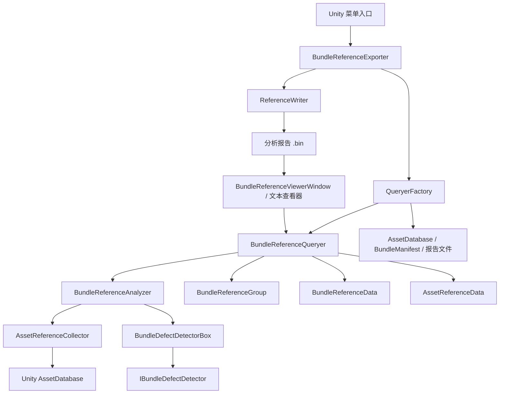

# Bundle Reference Viewer

## 1. 系统概述

Bundle Reference Viewer 是 UFlowFramework 提供的 Unity Editor AssetBundle 依赖分析工具，用于收集当前项目或已构建 Bundle 的依赖关系，并以分组、关系图和缺陷报告的方式定位资源分包问题。

它关注的是 **AssetBundle 之间的依赖关系以及 Bundle 内资源的直接依赖关系**，不负责构建 AssetBundle，也不负责修改资源的分包配置。分析结果可以保存为二进制报告，之后通过序列化数据重新打开和查看。

### 主要特点

- 同时分析 Bundle 依赖和 Bundle 内资源依赖，能够定位分包层级之外的资源组织问题。
- 将相互关联的 Bundle 自动组织为 `BundleReferenceGroup`，便于按关系组查看，而不是只查看孤立节点。
- 通过多个 `IBundleDefectDetector` 检查单资源引用、引用分散、依赖过深和循环引用等问题。
- 支持同步分析、分批异步初始化和已构建 Bundle 分析，降低 Editor 长时间无响应的风险。
- 分析结果可序列化为报告文件，查看阶段不必重复扫描整个项目。

### 主要组件 / 接口

| 组件 / 接口 | 职责 |
| --- | --- |
| `BundleReferenceExporter` | 组织分析生命周期，生成查询数据、执行检测并写出报告。 |
| `QueryerFactory` | 从当前项目、已构建 Bundle 或序列化报告创建 `BundleReferenceQueryer`。 |
| `BundleReferenceQueryer` | 保存 Bundle、资源和关系组数据，并提供查询入口。 |
| `BundleReferenceAnalyzer` | 收集资源依赖并驱动分组缺陷检测或单组缺陷检测。 |
| `BundleDefectDetectorBox` | 管理缺陷检测器，并将检测结果写入 Bundle 或分组数据。 |
| `IBundleDefectDetector` | 定义一个缺陷检测规则需要提供的名称、标签、等级和检测方法。 |
| `BundleReferenceData` / `AssetReferenceData` | 分别保存 Bundle 层和资源层的依赖、被引用关系及缺陷信息。 |
| `BundleReferenceGroup` | 保存一组相互关联的 Bundle 及其汇总缺陷信息。 |
| `BundleReferenceViewerWindow` | 提供 Bundle 分组列表、搜索、引用深度和关系图等 Editor UI。 |

### 组件 / 接口依赖关系



其中，`QueryerFactory` 负责提供数据源，`BundleReferenceQueryer` 负责建立关系模型，`BundleReferenceAnalyzer` 负责补充资源依赖并触发检测，UI 只消费查询结果，不直接承担分析逻辑。

## 2. 工作原理与优化

### 2.1 建立 Bundle 关系模型

分析开始时，`QueryerFactory` 从 `AssetDatabase.GetAllAssetBundleNames()` 获取 Bundle 名称，再通过 `AssetDatabase.GetAssetBundleDependencies(..., false)` 获取每个 Bundle 的直接依赖。查询器会把这些关系保存为：

- `bundleDependent`：当前 Bundle 依赖的 Bundle 集合。
- `bundleReferenced`：反向引用当前 Bundle 的 Bundle 集合。
- `BundleReferenceGroup`：根据 Bundle 邻接关系自动生成的关联分组。

`EnsureGroups()` 使用未分组集合和队列遍历相邻 Bundle，将互相可达的关系组织到同一个 `BundleReferenceGroup` 中。这样 UI 和缺陷汇总可以以关系组为单位工作。

### 2.2 收集 Bundle 内资源依赖

仅有 Bundle 级依赖还不足以解释问题。分析器会对每个 Bundle 获取资源路径，再由 `AssetReferenceCollector` 调用 `AssetDatabase.GetDependencies(assetPath, false)` 收集直接依赖。

收集时会忽略：

- 当前资源自身。
- 与当前资源属于同一个 Bundle 的依赖资源。

因此，`AssetReferenceData.assetDependent` 主要描述跨 Bundle 的资源依赖。查询器同时维护资源路径到 `AssetReferenceData` 的索引，并将资源数据挂接到对应的 `BundleReferenceData`。

### 2.3 缺陷检测流程

检测器由 `BundleDefectDetectorBox` 按顺序持有。对每个 Bundle，检测器可以：

1. 通过 `Detect(...)` 判断单个 Bundle 是否存在某类缺陷，并返回详情。
2. 将标签和详情写入 `BundleReferenceData`。
3. 通过 `HasDefect(...)` 判断整个 `BundleReferenceGroup` 是否命中该规则。
4. 将命中数量、等级和 Bundle 名称汇总到 `GroupDefectInfo`。

当前内置规则覆盖单引用单资源、引用分散、依赖深度和循环引用等典型分包问题。检测结果会保存在查询器中，因此关系图和序列化报告可以复用同一份结果。

### 2.4 分析结果的序列化

`BundleReferenceExporter.WriteReport()` 将有缺陷的 Bundle 汇总到 `BundleReferenceReport`，再使用 `ReferenceWriter` 写入 `Analysis/` 下的二进制文件。`QueryerFactory.GenerateQueryerBySerializedData(...)` 可以重新读取该文件并恢复 Bundle 关系和缺陷标签。

序列化报告保存的是用于查看和汇总的 Bundle 级数据，不等同于实时重新读取 Unity `AssetDatabase`。项目分包配置发生变化后，应重新执行分析。

### 2.5 异步与内存优化

- `GenerateQueryerByCurrentProject(int analysisBatchSize)` 每处理指定数量的 Bundle 就 `await Task.Yield()`，让 Editor 有机会处理界面和取消操作。
- 资源收集使用可复用的临时 `List<AssetReferenceData>`，避免每个分组重复创建列表。
- `AssetReferenceData` 使用 `HashSetPool<string>` 管理依赖集合，释放时归还对象池，降低大量资源分析时的短期分配压力。
- 查询器、检测器和资源数据均实现 `IDisposable`，分析器和窗口关闭时应及时释放它们持有的集合和缓存。

异步初始化只改善 Editor 调度，不代表 Unity `AssetDatabase` 可以在后台线程安全调用；项目资源查询仍应遵循 Unity Editor API 的线程限制。

## 3. 使用方法

### 3.1 从当前项目生成分析报告

在 Unity Editor 中执行 `Tools > UFlow > Bundle Analysis > Create Analysis File`。该入口会：

1. 创建 `BundleReferenceExporter`。
2. 从当前项目生成 `BundleReferenceQueryer`。
3. 收集 Bundle 内资源依赖并执行缺陷检测。
4. 将报告写入分析目录。
5. 打开文本查看窗口。

对应的代码入口如下：

```csharp
using UnityEditor;

// 等价于执行菜单：Tools/UFlow/Bundle Analysis/Create Analysis File
EditorApplication.ExecuteMenuItem(
    "Tools/UFlow/Bundle Analysis/Create Analysis File");
```

如果工具菜单不可用，应先确认项目中已经存在 AssetBundle 名称；没有分包数据时不会产生有意义的关系图。

### 3.2 在 Editor 工具中直接分析并读取结果

当其他 Editor 工具需要复用分析结果时，可以直接组合工厂、分析器和查询器：

```csharp
using PowerCellStudio.Editor;

using var queryer = QueryerFactory.GenerateQueryerByCurrentProjectSync();
using var detectorBox = new BundleDefectDetectorBox();

BundleReferenceAnalyzer.DetectorGroupDefect(queryer, detectorBox);

foreach (var pair in queryer.GetAllBundleData())
{
    var bundleData = pair.Value;
    if (bundleData.defectLevel != DefectLevel.None)
    {
        UnityEngine.Debug.Log(
            $"Bundle {bundleData.bundleName} 存在：{string.Join(", ", bundleData.tags)}");
    }
}
```

`using` 结束后会释放查询数据和检测器。若要保留结果供之后查看，应使用 `BundleReferenceExporter` 写出报告，而不是在释放查询器后继续访问它。

### 3.3 读取已有分析文件

已有报告可以直接恢复查询器，不需要再次扫描当前项目：

```csharp
using PowerCellStudio.Editor;

var queryer = QueryerFactory.GenerateQueryerBySerializedData("Analysis/20260831120000.bin");
if (queryer == null)
    return;

try
{
    var group = queryer.GetGroupByBundle("characters");
    if (group != null)
        UnityEngine.Debug.Log($"关联 Bundle 数量：{group.bundleNames.Count}");
}
finally
{
    queryer.Dispose();
}
```

实际使用时应将示例中的报告路径和 Bundle 名称替换为项目中的有效值。关系图窗口则由 `BundleReferenceViewerWindow` 负责展示查询器中的分组和 Bundle 数据。

## 4. 扩展方法

### 4.1 当前可用的扩展点

缺陷检测规则通过 `IBundleDefectDetector` 抽象。自定义检测器需要实现：

- 展示名称、提示文本、标签和缺陷等级。
- `Detect(...)`：判断单个 Bundle 并生成详情。
- `HasDefect(...)`：判断整个关系组是否命中规则。

不过，当前 `BundleDefectDetectorBox` 在构造函数中直接创建内置检测器列表，没有公开的 `Register` 或注入入口。因此，自定义检测器目前属于 **源码级扩展**：实现接口后，还需要将实例加入 `BundleDefectDetectorBox` 的 `detectors` 初始化列表。以下示例展示检测器本身的实现方式；接入列表的修改需要同步维护框架源码。

```csharp
using PowerCellStudio.Editor;

public sealed class LargeBundleDefectDetector : IBundleDefectDetector
{
    public string title => "Large Bundle";
    public string toolTips => "Bundle 内资源数量超过阈值";
    public string tag => "LargeBundle";
    public DefectLevel defectLevel => DefectLevel.Warning;

    public bool Detect(
        BundleReferenceQueryer queryer,
        BundleReferenceData bundleData,
        out string defectDetail)
    {
        const int maxAssetCount = 500;
        var hasDefect = bundleData != null && bundleData.assets.Count > maxAssetCount;
        defectDetail = hasDefect
            ? $"资源数量：{bundleData.assets.Count}"
            : string.Empty;
        return hasDefect;
    }

    public bool HasDefect(
        BundleReferenceQueryer queryer,
        BundleReferenceGroup group)
    {
        if (group == null)
            return false;

        foreach (var bundleName in group.bundleNames)
        {
            var data = queryer.GetBundleData(bundleName);
            if (data != null && data.assets.Count > 500)
                return true;
        }

        return false;
    }
}
```

接入后，`BundleDefectDetectorBox` 会在执行 `DetectGroupDefect(...)` 或单 Bundle 检测时调用该规则，检测结果会和内置规则一样写入 `tags`、`defectDetail` 及分组汇总数据。

### 4.2 扩展时需要保持的约束

- `tag` 应保持稳定且唯一，否则报告中的缺陷信息可能互相覆盖。
- `Detect(...)` 和 `HasDefect(...)` 应使用同一判定标准，避免 Bundle 明细与分组汇总结果不一致。
- 检测器不要修改 `BundleReferenceQueryer` 的关系结构；检测结果应通过既有检测流程写入数据。
- 如果检测器持有缓存、文件句柄或其他资源，应实现 `IDisposable`，因为 `BundleDefectDetectorBox.Dispose()` 会释放可释放的检测器。
- 若需要运行时动态注册检测器，当前版本没有公共 API，应先改造 `BundleDefectDetectorBox` 的构造或增加显式注册入口，再接入业务代码。

## 5. 注意事项

- 分析当前项目时依赖 Unity `AssetDatabase`，应在 Unity Editor 环境执行，不能当作运行时系统使用。
- `GetAssetBundleDependencies(..., false)` 和 `GetDependencies(..., false)` 获取的是直接依赖；文档中的关系深度和循环判断由分析器基于这些直接关系推导。
- 资源必须已经被正确分配到 AssetBundle。未分配 Bundle 的资源不会作为目标 Bundle 节点参与同等层级的分析。
- 分析报告是项目状态的快照。修改 AssetBundle 名称、依赖或资源归属后，旧报告不会自动更新。
- `GenerateQueryerByExitedBuild()` 依赖 `BundleReferenceManifest.manifest` 和已构建 Bundle 目录；调用前必须完成 Manifest 准备，否则工厂会提示先执行 `BundleReferenceManifest.PrepareManifest()`。
- 查询器、检测器和相关数据实现了释放逻辑。窗口关闭、分析重启或读取完成后，不要继续使用已经 `Dispose()` 的实例。
- 异步分析可以通过进度条取消，但取消发生在分析流程中时会抛出 `OperationCanceledException`；调用方应确保进度条最终被清理。
- 大型项目的资源依赖收集可能耗时较长。应优先使用异步初始化或读取已有序列化报告，避免在 Editor 主界面执行不必要的重复分析。
- 当前缺陷检测器列表由代码固定创建。添加自定义规则前需要评估源码修改、版本合并和报告兼容性成本。

## 6. 推荐使用场景

- **AssetBundle 分包方案检查**：在发布前发现跨 Bundle 依赖、依赖过深和循环引用，减少加载链路和包体组织问题。
- **资源依赖可视化**：通过关系图查看一个 Bundle 所依赖的资源和 Bundle，辅助定位异常引用来源。
- **分包规则回归检查**：每次修改资源归属或构建策略后生成报告，与历史分析结果结合检查缺陷是否增加。
- **大型项目的 Editor 诊断**：使用分批异步初始化和序列化报告，避免反复扫描全部 AssetDatabase 数据。
- **自定义资源规范检查**：通过 `IBundleDefectDetector` 增加项目特有规则，例如 Bundle 资源数量上限、特定资源类型禁止跨包引用等。

不推荐将该系统用于运行时资源管理、AssetBundle 自动构建或实时监控；这些职责不属于 Bundle Reference Viewer，应由构建流程、资源加载系统或专门的运行时监控模块承担。
